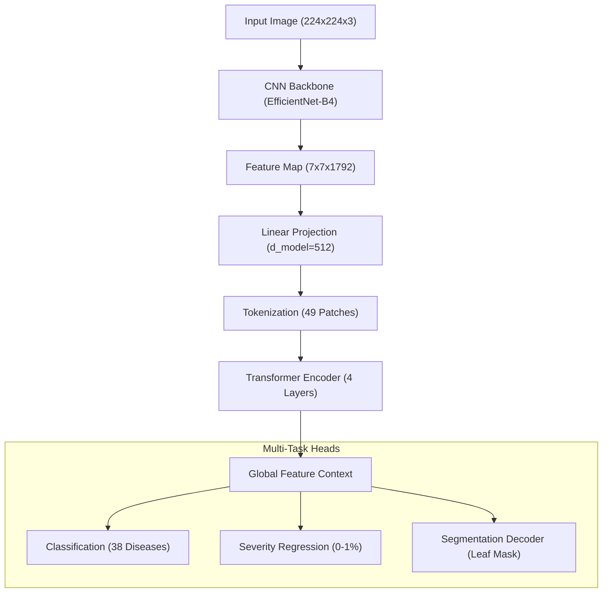

# TransAgroNet: Architecture Documentation

## Overview
TransAgroNet is a hybrid Deep Learning architecture designed for precision agriculture. It combines the local spatial feature extraction of Convolutional Neural Networks (CNNs) with the global context capabilities of Vision Transformers (ViTs).

## Architecture Diagram

## Key Features
1. **Multi-Scale Learning**: Uses EfficientNet's compound scaling for high-resolution feature maps.
2. **Global Context Bridge**: The Transformer layers allow the model to correlate distant symptoms on a single leaf.
3. **Multi-Task Optimization**: Simultaneously optimizes for what the disease is, how severe it is, and where it is located.
4. **Production Ready**: Full support for mixed precision training and ONNX/TFLite export.

## Hyperparameters
- **Backbone**: EfficientNet-B4 (Pretrained on ImageNet)
- **Transformer Layers**: 4 layers, 8 heads, 512-dim embedding
- **Optimizer**: AdamW (lr=1e-4, wd=1e-2)
- **Scheduler**: Cosine Annealing
- **Loss**: Weighted (Cross-Entropy + MSE + Dice Loss)
